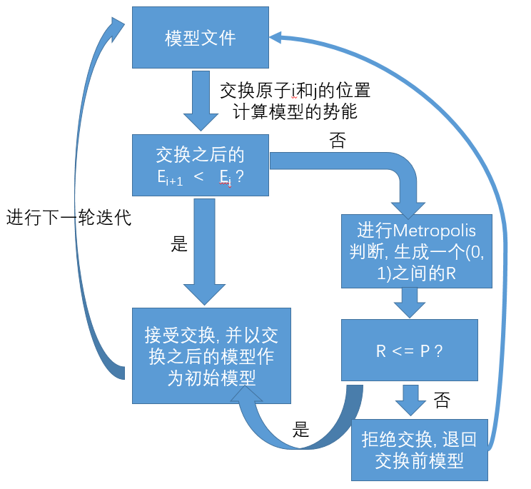
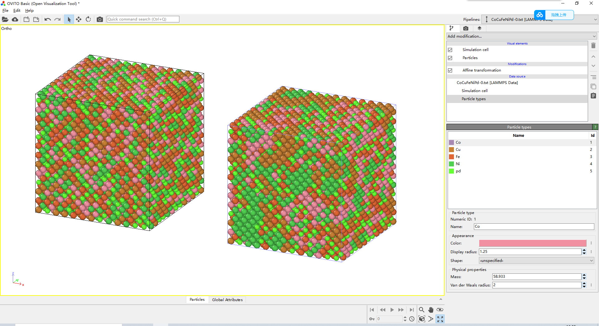
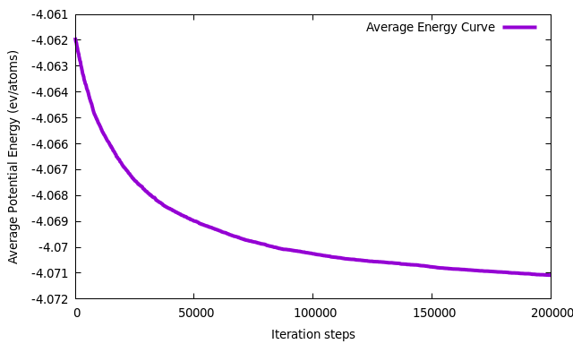
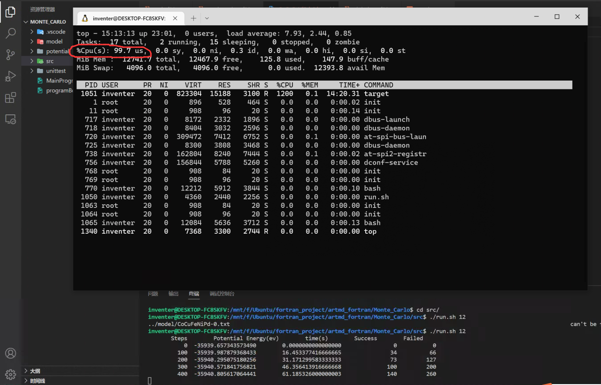

# MC迭代法的基本思想和流程

​		MC, 全名蒙特卡洛(Monte Carlo), 是分子动力学中常用的一种方法, 其基本思想是随机大量取样, 从中选择最好的解, 样本越大越接近准确解. 在分子动力学中, MC的应用范围极广, 包括吸附, 溶液的一系列领域都有应用, 但是那些都不在今天的讨论范围之内, 今天我们将撰写一个最基础的MC迭代程序, 不考虑化学势差, 不考虑MC/MD混合模拟, 以获得一个比起随机替换原子更有序的原子模型, 即一个具有短程有序的合金模型.

​		在开始写程序之前, 还需要给大家介绍一下Metropolis判据, 这个判据的的基本思想是以概率接受新状态, 这么说可能会有点抽象, 没关系, 我们结合以下流程图进行分析:

​		

​		而上图中的P按照如下公式进行计算:


​		上式中, k为热力学常数, 也叫**玻尔兹曼常数**, 在SI单位制下为**K=1.380649 × 10-23 J/K**, 在我们会用到的metal单位制中, 能量的单位为ev, 而温度依然是K, 这时**K = 8.617343e-5 ev/k**,T为MC迭代时候的温度, **E(i+1)**是交换原子之后的模型势能, 而**E(i)**是交换原子之前的模型势能. 讲完基础知识之后, 我们来看看上面的流程图:

​		首先第一步, 随机交换模型中2个原子的位置, 即原子I和原子J, 计算交换前后的势能**E(i+1)**和**E(i)**, 进行判别, 如果发现交换之后模型的势能小于交换之前的, 即**E(i+1) < E(i)**, 那么我们就接受这一次的交换, 并用交换之后的模型当成新的起点重新进行MC迭代, 那么如果发现交换之后, 原子的势能更高了, 那么, 这个交换是否就应该被丢弃不用? 并不是, **Metropolis**提出了一种方法, 如果发现交换前后的势能升高, 就计算**Metropolis**判据P, 这个P是一个(0, 1)之间的数, 计算公式如上图所示, 之后再用一个在(0, 1)上均匀分布的随机数R, 去与P进行比较, 判断是否接受这个交换.

​		我们这里可以看出, 在低温下, 只能接受与当前状态能差较小的的模型, 高温下可接受与当前状态能差较大的模型, 而这也与我们的认知是比较相符的, 而至于为什么是图二中的数学公式? 我也不知道, 但是这个公式背后是有非常深刻和严谨的数学逻辑的, 凡是涉及MC迭代的程序, 包括**LAMMPS**中的**fix atom/swap**命令, 都会利用这个判据进行**重要性采样**, 在很多研究短程有序和MC模拟的分子动力学文章中, 这个公式也反复的出现, 同学们无须知道这个公式如何推导, 只需要会用和编程即可.


# MC迭代法的编程实现

​		好的, 说了那么久, 终于要正式进入主题了, 即编程实现MC迭代算法, 现在, 在我们有了前2期读取并计算模型的势能的子程序的情况下, 为了实现MC算法, 我们还需要哪些额外的程序呢? 首先, 从流程图上来看, 显然我们需要至少2个子程序, 一个用于交换模型中2个原子的位置, 而另一个用于生成2个不重复的随机整数, 且大小应该在1 - 原子的个数之间, 用于指定交换的2个原子的ID, 这两个子程序都很简单, 代码如下:

```fortran
  pure subroutine SwapType(Atoms, i, j)
    !! 交换第i个和第j个原子的类型ID
    type(Atom), intent(inout), dimension(:) :: Atoms  !< 存储原子坐标和邻居列表的ATOM类数组
    integer, intent(in) :: i, j                       !< 需要交换原子类型的第i个和第j个原子
    integer :: tempID                                 !< 用于存储的临时的类型id

    tempID = Atoms(i)%typeId
    Atoms(i)%typeId = Atoms(j)%typeId
    Atoms(j)%typeId = tempID

  end subroutine SwapType
```

```fortran
  function RandomInt(lowLimit, upLimit) result(res)
    integer, intent(in) :: upLimit, lowLimit  !< 分别对于想要生成的整数的上限和下限
    integer :: up, low
    integer :: res(2)
    real(wp) :: tempI, tempJ
	
	!! 为了防止用户不小心搞反上限和下限的输入顺序, 这里强制再做一次转换, 确保万无一失
    up = max(upLimit, lowLimit)
    low = min(upLimit, lowLimit)
    
    !! 随机生成2个不重复原子ID, 用于交换原子
    do 							
      call Random_Number(tempI)
      call Random_Number(tempJ)
      res(1) = nint(tempI * up)
      res(2) = nint(tempJ * up)
      if (res(1) /= res(2) .and. All(res >= low)) exit	!! 只有2个随机整数不相等且都大于0的时候才能退出循环
    end do
  end function RandomInt
```

​		先来解释一下**SwapType**这个子程序, 在这个子程序中, 我们只交换了2个原子的类型ID, 因为我想要的MC迭代是保证所有原子的组分比不变的情况下, 让模型的短程有序尽可能的更高, 至于为什么不交换坐标? 因为完全没必要, 交换了类型ID之后就等同于交换坐标了.

​		之后就是**RandomInt**这个子程序了, 这个子程序将会生成2个不重复的随机数, 且保证每次生成的随机数都在用户设置的**(lowLimit, upLimit)**之间, 然后这里提及一下, **Random_Number()**是Fortran的内置子程序, 会返回一个在(0, 1)的随机浮点数, 这里我们假设模型有6000个原子, 那么**lowlimit**就是1, 而**uplimit**则是6000, **tempI * up**的取值范围就是[0, 6000]之间的任意的一个整数, 但是我们会发现这样有可能会返回0, 而0不是我们想要的结果, 所以我们再最后加了一个判断, 只有2个随机数都大于等于下限, 才能退出循环.

​		好的, 现在我们需要的一切工具子程序都准备好了......吗? 并没有, 不要忘记我们的目的, 我们想要的是MC迭代之后获得具有高**短程有序(SRO)**的合金模型, 现在回过头来看, 模型导出的子程序呢? 光MC迭代, 没法把模型导出来, 那可对我们一点用没有, 因此, 我们将撰写一个子程序**WriteData**用于导出**lammps**和**OVITO**可以识别的模型文件:

```fortran
  subroutine WriteData(filename, eampot, box, Atoms)
    !! 将迭代完成之后的模型以lammps和ovito可以读取的格式输出到文件中
    character(len=*), intent(in) :: filename  !< 模型文件的名称
    type(eamAlloyFile), intent(in) :: eampot  !< 存放势函数信息的派生变量, 这里其实只需要每种元素的原子质量
    type (region),intent(in) :: box           !< 记录仿真盒子尺寸的派生变量
    type(Atom), intent(in) :: Atoms(:)        !< 存储原子坐标和邻居列表的ATOM类数组
    integer :: fileId             !< 模型文件对应的通道ID
    integer :: i                  !< 循环变量
    integer :: nTypes             !< 模型文件中有多少种元素
    integer :: nAtoms             !< 模型中有多少个原子

    nAtoms = size(Atoms)			!! 获取模型中的原子个数
    nTypes = maxval(Atoms%typeId)	!! 获取模型中的原子类型数
    open(newunit=fileId, file=filename, action='write')					!! 打开模型文件
    write(fileId, '(A)') '# This is the file after MC interation.'		!! 第一行为注释行
    write(fileId, *)
    write(fileId, '(T10, I0, 1X, A)') nAtoms, ' atoms'
    write(fileId, '(T10, I0, 1X, A)') nTypes, ' atom types'
	
	!! 将盒子相关信息写入进去
    write(fileId, *)
    write(fileId, *) box%xlo, box%xhi, 'xlo xhi'
    write(fileId, *) box%ylo, box%yhi, 'ylo yhi'
    write(fileId, *) box%zlo, box%zhi, 'zlo zhi'
    write(fileId, *)

    write(fileId, '(A)') 'Masses'
    write(fileId, *)
	
	!! 将所有原子和对应的原子质量, 元素符号写入
    do i = 1, nTypes
      write(fileId, '(T10, I0, 1X, G0, 1X, A, 1x, A)') i, eampot%Amass(i), '# ', eampot%elementName(i)
    end do
    write(fileId, *)

    write(fileId, *) 'Atoms # atomic'
    write(fileId, *)
    
    !! 将所有原子的坐标和id写入
    do i = 1, nAtoms
      write(fileId, *) i, Atoms(i)%typeId, Atoms(i)%x, Atoms(i)%y, Atoms(i)%z
    end do
    close(fileID)
    
  end subroutine WriteData
```

​		除了写出模型数据之外, 实际上从外部文件读取MC迭代需要的参数也是十分必要的, 而对于一个最基本的MC迭代, 只需要4个参数即可完成, 分别是势函数文件的名字, 模型文件的名字, MC迭代的温度, 和迭代步数:

```fortran
  subroutine InitialParameter(potentialName, modelName, temprature, iterSteps)
    !! 根据命令行的参数打开对应的文件按Fortran的namelist格式读取仿真参数
    character(len=*),intent(out) :: potentialName         !< 势函数文件名称
    character(len=*), intent(out) :: modelName            !< 模型文件名称
    real(wp), intent(out) :: temprature                   !< MC迭代的特征温度
    integer, intent(out) :: iterSteps                     !< MC迭代步数
    character(len=128) :: fileName                        !< 包含了用于仿真的格式化的namelist文件
    integer :: fileId                                     !< 文件通道ID
    integer :: ioFlag                                     !< 判断文件读取是否到末尾
    logical :: isExist                                    !< 判断文件是否存在的逻辑变量
    namelist /parameter/ potentialName, modelName, temprature, iterSteps   !< 需要从外部文件读取的相关仿真参数的数据集合

    call get_command_argument(number=1,value=fileName)    !! 从命令行的第一个参数中获取namelist文件名称

    !! 查询文件是否存在, 如果不存在就报错并终止程序
    inquire(file=filename, exist=isExist)
    if (.not. isExist) then
      write(stdout, '(A, A)') trim(filename), " can't be found in current path."
      stop
    end if
    
    !! 打开文件
    open(newunit=fileId, file=trim(fileName), action='read')
    
    read(fileId, nml=parameter, iostat=ioFlag)   !! 按namelist格式读取文件内容
    close(fileId)                 !! 关闭文件

  end subroutine InitialParameter
```

​		对应的标准的namelist格式的输入文件如下:

```fortran
&PARAMETER
potentialName = '../potential/CoCuFeNiPd.set'
modelName = '../model/CoCuFeNiPd-0.txt'
temprature = 300.d0
iterSteps = 60000
/

```

​		至此, 我们才称的上把一个MC迭代需要的工具子程序都准备好了, 接下来编写如下的主程序进行MC迭代:

```fortran
program main
  use random, only: RandomInt
  use global_var, only: wp, stdout, THREADS, Bolz
  use fileIO, only:  Atom, ReadData, region, eamAlloyFile, &
      ReadEamAlloyFile, WriteData, InitialParameter 
  use computeUE, only: Energy, SwapType
  implicit none
  type(eamAlloyFile) :: Potential        !< 势函数文件中的内容
  type(Atom), allocatable :: Model(:)    !< 模型文件
  type(region)  :: box                   !< 仿真盒子
  character(len=128) :: potentialName    !< 势函数文件名称
  character(len=128) :: modelName        !< 原子模型文件名称
  real(wp) :: Ep                         !< 迭代之前的能量(previous)
  real(wp) :: En                         !< 迭代之后的能量(next)
  real(wp) :: temprature                 !< MC迭代的特征温度
  real(wp) :: start, end                 !< 用于统计程序的运行时间
  real(wp) :: P                          !< Metropolis判据对应的可能性
  real(wp) :: posibility                 !< 一个在0-1之间的均匀分布的随机数, 与Metropolis判据对比判断是否接受交换
  real(wp) :: kT                         !< 物理意义是Metropolis指数部分的分母, 为了减小计算量值等于1/kT  
  integer :: iterSteps                   !< MC迭代步数
  integer :: i                           !< 循环变量
  integer :: atomID(2)                   !< 需要交换的2个原子的ID
  integer :: nAtoms                      !< 原子数量
  integer :: success = 0                 !< 交换成功的次数
  integer :: failed = 0                  !< 交换没成功的次数
  logical :: accepted = .false.          !< 判断交换原子前后的模型是否接受
  
  ! 结果: CoCuFeNiPd-0.txt: -35939.7479428878 ev
  call random_seed    !! 初始化随机种子
  call InitialParameter(potentialName, modelName, temprature, iterSteps)  !! 从命令行读取含有namelist参数的文件
  call ReadEamAlloyFile(potentialName, Potential)     !! 读取势函数文件里面的全部信息
  call ReadData(modelName, box, Model)                !! 读取模型文件里面的全部信息
  call Energy(Potential, Model, Ep, box)              !! 计算模型的初始势能
  write(stdout, '(T8, *(A, 8X))') 'Steps', 'Potential Energy(ev)', 'time(s)', 'Success', 'Failed'
  write(stdout, *)  0, Ep, 0.0000000000000d0, success, failed
  
  nAtoms = size(Model)    !! 记录模型中含有几个原子
  kT = 1.d0 / Bolz * temprature
  call cpu_time(start)    !! 开始计时

  !! 正式开始MC迭代, 最多迭代iterSteps次
  do i = 1, iterSteps
    atomID = RandomInt(1, nAtoms)               !! 随机生成2个原子ID用于交换
    call SwapType(Model, atomID(1), atomID(2))  !! 交换原子类型ID
    call Energy(Potential, Model, En, box)      !! 计算交换原子之后的势能
    accepted = En < Ep                !! 对比交换前后两次模型的势能, 如果减小了就接受
    if (.not. accepted) then          !! 如果发现模型势能没有变小, 进行Metropolis判别
      P = exp((Ep - En) * kT)     	  !! 计算Metropolis判据
      call random_number(posibility)  !! 生成0-1之间的均匀分布的随机数
      if (posibility <= P) then       !! 如果发现当前模型符合Metropolis判据, 也接受交换
        Ep = En                       !! 减小了之后, 记录这一次的交换原子之后的能量
        success = success + 1         !! 成功次数加一
      else                            !! 如果势能没有减小且不符合Metropolis判据, 交换回去
        call SwapType(Model, atomID(2), atomID(1))
        failed = failed + 1
      end if
    else
      Ep = En                   !! 减小了之后, 记录这一次的交换原子之后的能量
      success = success + 1     !! 成功次数加一
    end if

    if (mod(i, 100) == 0) then !! 每100步输出一次相关的信息和输出模型
      call cpu_time(end)
      write(stdout, *) i, Ep, (end - start), success, failed
      call WriteData('../model/MC_Model.lmp', Potential, box, Model)
    end if
  end do
  
end program main
```

​		虽然上述代码文本量较多, 但是我认为逻辑清晰, 对比图1中的流程图, 还是比较易于理解的, 所以不再做过多的赘述. 那么写完代码之后的第一件事情当然就是编译运行和对比结果, 这里我将会以一篇NC文章《Simultaneously enhancing the ultimate strength and ductility of high-entropy alloys via short-range ordering》进行对比, 因为这篇文章中公开了里面使用的3个模型, 分别是随机替换原子模型, MC迭代200W次模型, 和MC迭代400W次的模型, 模型是等原子比的 CoCuFeNiPd 高熵合金. 势函数在这篇文献对应的网址中也有相应的提供.当然由于计算量极其巨大, 我这里只用了我的程序迭代了20w步, 和文献中的模型肯定比不了, 但是至少趋势是完全相同的. 首先是运行方法, 我这里依然是写了一个小脚本, 用于快速设置并行运行环境.

```shell
#!/bin/bash
export OMP_NUM_THREADS=$1
./mc $2
```

​		对应的Makefile		

```makefile
FC = gfortran
TARGET = mc
FFLAGS = -O3 -Wall -fopenmp
OBJS = global_var.o mod_fileIO.o mod_computePE.o mod_random.o main.o

${TARGET}: ${OBJS}
	${FC} $^ -o $@ -fopenmp	

%.o: %.f90
	${FC} -c $< ${FFLAGS} -o $@

.PHONY: clean

clean:
	rm -rf *.mod *.o ${TARGET}
```

​		**$1**和**$2**会被命令行的第一个参数和第二个参数替换, 这里我们假设应该使用4核并行 + 参数文件名为parameter.nml, 那么运行方法就应该是:

```shell
./run.sh 4 parameter.nml
```

​		现在我们的程序正以4核并行进行MC迭代运算!


​		当然这里迭代步数太少, 看不出什么, 虽然确实模型的势能在不断的减少. 这里我直接放上我20W次迭代前后的模型和迭代过程中势能曲线的变化曲线图, 以及CPU利用率的图片:







​		可以看到, 非常完美, 随着迭代的进行模型势能不断下降, 并且在迭代了20w次之后, 模型出现了显著的元素偏聚和元素分离, 而且在计算过程中, CPU的利用率始终在98%以上, 这个利用率是串行程序根本无法达到的程度. 至于元素偏聚是不是和文章中的趋势一样, 就请同学们自行阅读文献进行对比了.

​		那么到目前为止, 我们利用我们的知识完成了一个最基础最原始的MC迭代程序的编写, 但是这个程序还有很多可以提高的空间, 比如采用**MPI**实现并行, 提高并行效率, 或者优化随机数算法, 使其更快生成随机数, 或者一次可以不选择2个原子, 而是选择4个或者8个乃至更多个原子进行交换, 然后再进行**Metropolis**判断, 又或者仿照**LAMMPS**中的**fix atom/swap**, 指定对2类原子进行交换, 这一点使用Fortran的内置函数**pack()**, 再加上一些小技巧就可以很轻松的实现, 模仿**LAMMPS**的输出加一个写出log文件的子程序也是一个非常不错的想法. 然后再说明一下, 这种最原始的MC迭代算法效率极低, 基本上迭代到了50w步之后,  模型的势能就几乎停滞不前了, 无法再进一步下降了, 需要想办法从各个方面进一步优化这个算法. 代码和模型文件将在文章的最后一并给出.


# 源代码和模型文件

链接：https://pan.baidu.com/s/1yog8EKaRatIFpowRMCYP3A 
提取码：kcf3 
--来自百度网盘超级会员V6的分享